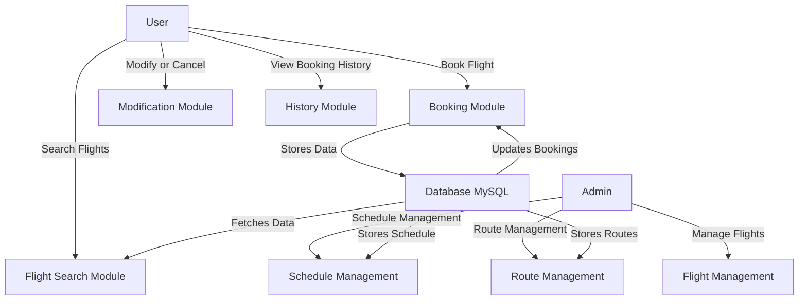

# ✈️ Flight Management System


---

## 🚀 Project Overview

The **Flight Management System** is a robust, Java-based web application designed to streamline airline ticket bookings and flight management. It provides an intuitive interface for **customers** to book, modify, and cancel flights effortlessly, while also enabling **administrators** to manage schedules, routes, and overall airline operations efficiently.

> ✨ **Why This Project?**
> - Simplifies **flight bookings** and management.
> - Ensures seamless coordination between **customers** and **airlines**.
> - Provides a **scalable** and **secure** backend with Spring Boot & MySQL.

---


## 📸 Application Screenshots

### 🔐 Login Page


### 📝 Register Page


### 🏢 Admin Dashboard


### 🎫 Flight Booking Interface


### 🛫 Boarding Page


---

## 🔥 System Architecture Diagram



---

## ✨ Features

### 🛫 Customer Features:
- 👤 **User Registration & Login** – Secure authentication with encrypted passwords.
- 🔍 **Search Flights** – View available flights based on destination, date, and time.
- 🎫 **Book a Flight** – Make reservations in real-time.
- 🔄 **Modify or Cancel Booking** – Change/cancel flights as per policy.
- 🗂 **View Booking History** – Track past & upcoming flight details.

### 🏢 Administrator Features:
- 🔐 **Admin Login** – Access a dedicated admin panel.
- ✈️ **Manage Flights** – Add, update, or remove flights.
- 📅 **Schedule Management** – Adjust flight schedules to prevent conflicts.
- 🌍 **Route Management** – Set flight routes between airports.

---

## 📌 Project Scope

### ✅ **In-Scope:**
✔️ Fully functional **customer booking system**.  
✔️ Comprehensive **admin panel** for flight management.  
✔️ Secure **user authentication** & authorization.  
✔️ Seamless **CRUD operations** for flights, schedules, and routes.  

### ❌ **Out-of-Scope:**
❌ Boarding pass generation.  
❌ Integration with external payment gateways.  
❌ Real-time flight tracking & live seat availability.

---

## 🛠️ Tech Stack

| Backend  | Database | Frontend  | Tools |
|----------|----------|-----------|--------|
| Java 8+  | MySQL    | HTML/CSS/JS | Maven/Gradle |
| Spring Boot | JDBC | Bootstrap | Postman (API Testing) |
| Spring Security | Hibernate | Thymeleaf | Git/GitHub |

---

## 🔥 Modules Implemented

1. **🔐 Authentication & Authorization** – User registration, login, and secure session management.
2. **✈️ Flight Booking System** – Flight search, booking, and modification functionalities.
3. **📅 Schedule Management** – Admins can schedule flights and prevent duplicate bookings.
4. **👥 Passenger Information** – Securely store & manage passenger details.
5. **📊 Admin Dashboard** – A responsive panel for administrators to manage everything.

---

## 🏗️ Installation & Setup

### 📌 Prerequisites:
- Java Development Kit (JDK) 8+
- MySQL Database
- Maven/Gradle for dependency management

### 🛠️ Steps to Run the Project:

1️⃣ **Clone the repository:**
```bash
 git clone https://github.com/your-github-username/flight-management-system.git
 cd flight-management-system
```

2️⃣ **Configure the Database:**
```sql
CREATE DATABASE flight_management;
USE flight_management;

CREATE TABLE users (
    userId BIGINT PRIMARY KEY AUTO_INCREMENT,
    userType VARCHAR(50),
    userName VARCHAR(100),
    userPassword VARCHAR(100),
    userPhone BIGINT,
    userEmail VARCHAR(100)
);
-- Add other necessary tables
```

3️⃣ **Update Database Credentials in `application.properties`:**
```properties
spring.datasource.url=jdbc:mysql://localhost:3306/flight_management
spring.datasource.username=root
spring.datasource.password=your_password
```

4️⃣ **Run the Project:**
```bash
mvn spring-boot:run
```

5️⃣ **Access the Application:**
```
http://localhost:8080
```

---

## 🏆 Project Timeline

### 📅 Milestones:
| Milestone | Task | Duration |
|-----------|-----------------------------|-----------|
| ✅ M1 | Authentication & Registration | Weeks 1-3 |
| ✅ M2 | Flight Booking System | Weeks 4-5 |
| ✅ M3 | Schedule & Passenger Management | Weeks 6-7 |
| ✅ M4 | Admin Dashboard & Final Testing | Weeks 8-10 |

---

## 🚀 Future Enhancements

✨ **Payment Gateway Integration** – Enable secure online payments.  
✨ **Boarding Pass Generation** – Automatically generate printable passes.  
✨ **Real-time Flight Tracking** – Show flight status with live updates.  
✨ **SMS/Email Notifications** – Send booking confirmations & reminders.

---

## 📞 Contact & Contribution

🤝 Want to contribute? Feel free to fork the repo and submit a PR!  
📩 **Contact me at:** [your-email@example.com](mailto:your-email@example.com)  
🚀 **GitHub Repository:** [Flight Management System](https://github.com/your-github-username/flight-management-system)
